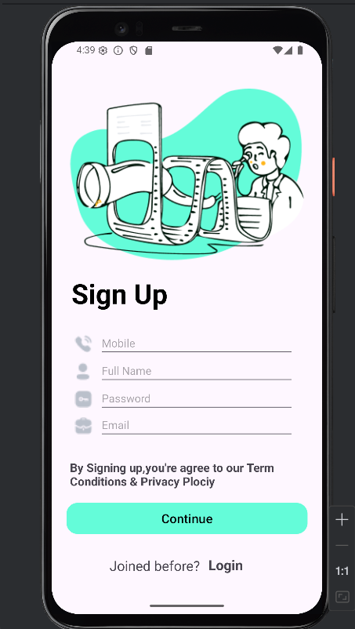
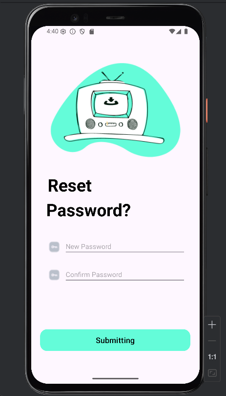
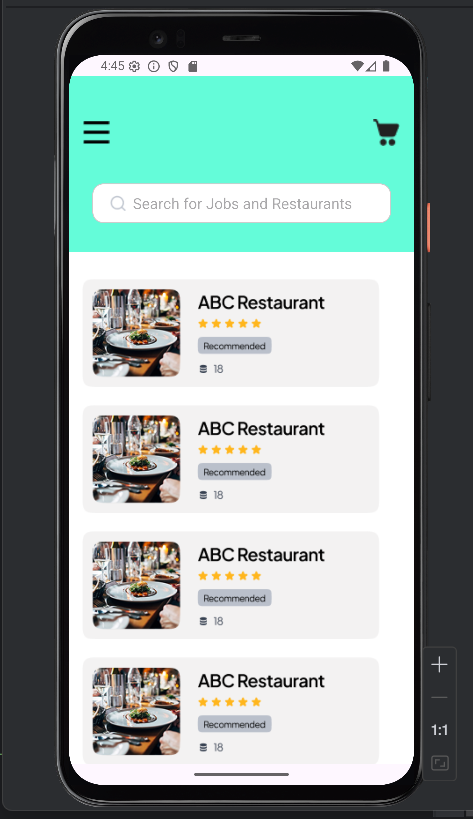

Used Components and Features:
Layout Structure
ConstraintLayout: Used for defining the position relationships between elements.
ScrollView: Added to allow vertical scrolling for long content.
LinearLayout:Horizontal and vertical alignment for components

Visual Elements
ImageView: Used to display the logo, cart icon, and other visual content.
Button / MaterialButton: Used for user interactions (e.g., login, selection).
Customizations:
-background set to drawable/rounded_button.xml
-Styled with cornerRadius, backgroundTint, icon, iconGravity, and more.

Text and Input
TextView: Used for titles, descriptions, and static text.
EditText: Used as a search bar.

Customizations:
drawableStart used to add a search icon on the left
Styled with hint, padding, and a custom background.

Style and Shape Features
->shape drawable files (edittext_bg.xml):
->Rounded corners (corners)
->Background color (solid)
->Border (stroke)
->Colors were defined using HEX codes (e.g., #64FCD9, #FFFFFF) or through colors.xml.

UI Features
* Clean and modern design
* Rounded buttons and input fields
* Icon-supported components (search, cart, etc.)
* Mobile-responsive layout

