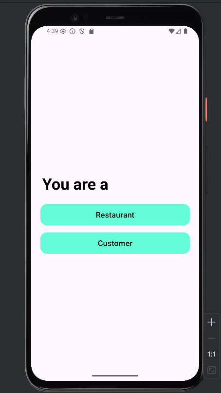
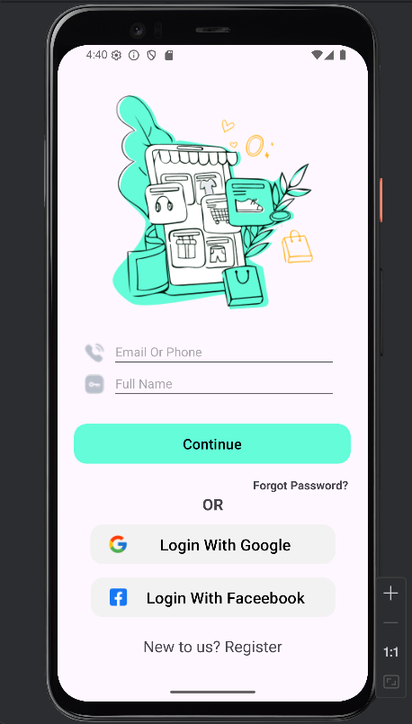
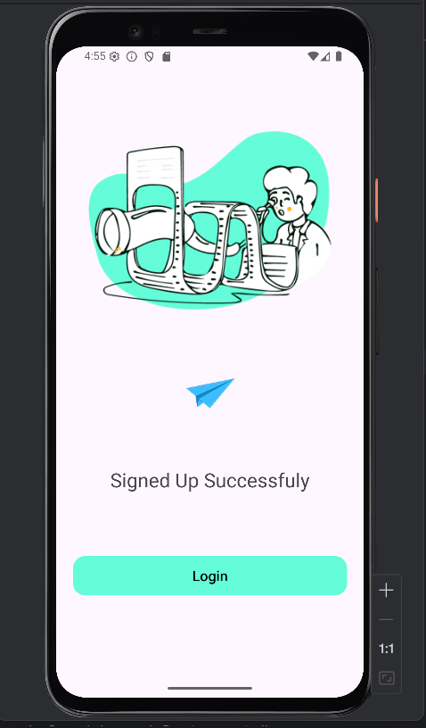

Used Components and Features:
Layout Structure
ConstraintLayout: Used for defining the position relationships between elements.
ScrollView: Added to allow vertical scrolling for long content.
LinearLayout:Horizontal and vertical alignment for components

Visual Elements
ImageView: Used to display the logo, cart icon, and other visual content.
Button / MaterialButton: Used for user interactions (e.g., login, selection).
Customizations:
-background set to drawable/rounded_button.xml
-Styled with cornerRadius, backgroundTint, icon, iconGravity, and more.

Text and Input
TextView: Used for titles, descriptions, and static text.
EditText: Used as a search bar.

Customizations:
drawableStart used to add a search icon on the left
Styled with hint, padding, and a custom background.

Style and Shape Features
->shape drawable files (edittext_bg.xml):
->Rounded corners (corners)
->Background color (solid)
->Border (stroke)
->Colors were defined using HEX codes (e.g., #64FCD9, #FFFFFF) or through colors.xml.

UI Features
* Clean and modern design
* Rounded buttons and input fields
* Icon-supported components (search, cart, etc.)
* Mobile-responsive layout

import RPi.GPIO as GPIO
import time
from RPLCD.i2c import CharLCD

# --- GPIO SETUP ---
SENSOR_PIN = 17
GREEN_LED = 22
RED_LED = 27
BUZZER = 23

GPIO.setmode(GPIO.BCM)
GPIO.setup(SENSOR_PIN, GPIO.IN)
GPIO.setup(GREEN_LED, GPIO.OUT)
GPIO.setup(RED_LED, GPIO.OUT)
GPIO.setup(BUZZER, GPIO.OUT)

# --- LCD SETUP ---
lcd = CharLCD(
    i2c_expander='PCF8574',
    address=0x27,
    port=1,
    cols=16,
    rows=2,
    charmap='A00'
)

lcd.clear()

try:
    while True:
        air_status = GPIO.input(SENSOR_PIN)

        lcd.clear()

        if air_status == 0:
            # HAVA TEMİZ
            GPIO.output(GREEN_LED, GPIO.HIGH)
            GPIO.output(RED_LED, GPIO.LOW)
            GPIO.output(BUZZER, GPIO.LOW)

            lcd.write_string("Hava Temiz")
            lcd.cursor_pos = (1, 0)
            lcd.write_string("Durum: IYI")

        else:
            # HAVA KIRLI
            GPIO.output(GREEN_LED, GPIO.LOW)
            GPIO.output(RED_LED, GPIO.HIGH)
            GPIO.output(BUZZER, GPIO.HIGH)

            lcd.write_string("Hava KIRLI!")
            lcd.cursor_pos = (1, 0)
            lcd.write_string("UYARI!!!")

        time.sleep(1)

except KeyboardInterrupt:
    print("Cikis yapiliyor...")

finally:
    lcd.clear()
    GPIO.cleanup()
